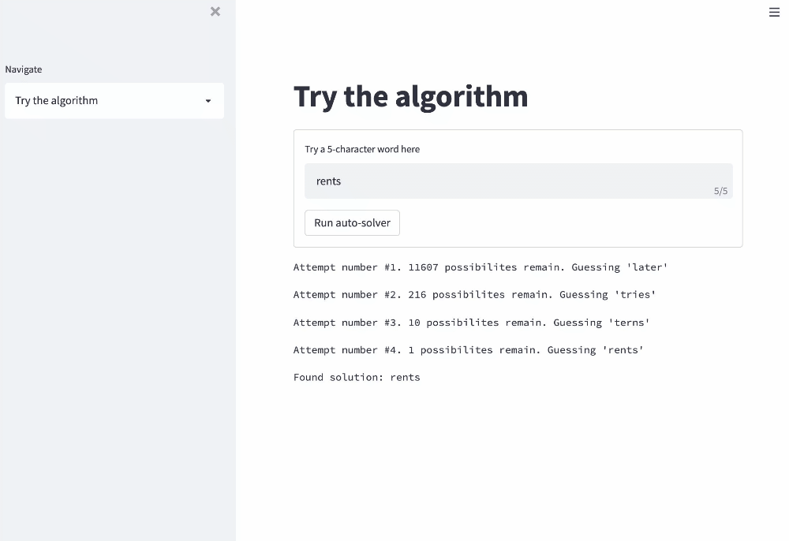

# wordgame-solver
Solver for popular 5-character word game


## Running locally 
```
pip install -r requirements.txt
streamlit run streamlit_wordgame.py
```

## Running via Docker
```
docker-compose up
```
and go to http://localhost:8501/

# Live App
Go to https://darinbaumgartel.github.io/wordgame-solver/

# Demo



